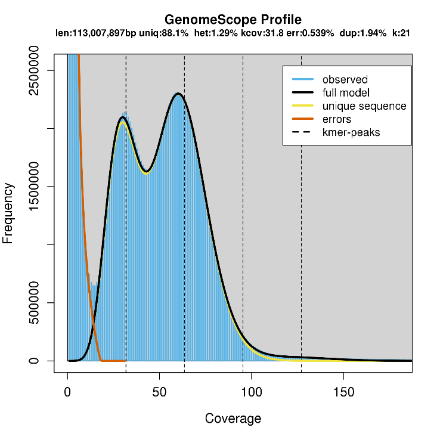
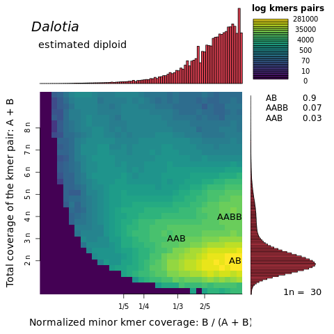
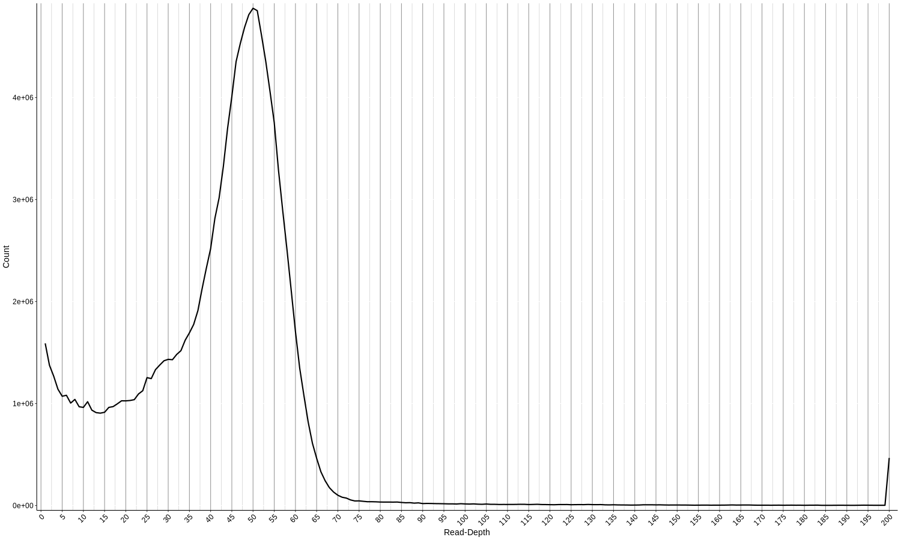
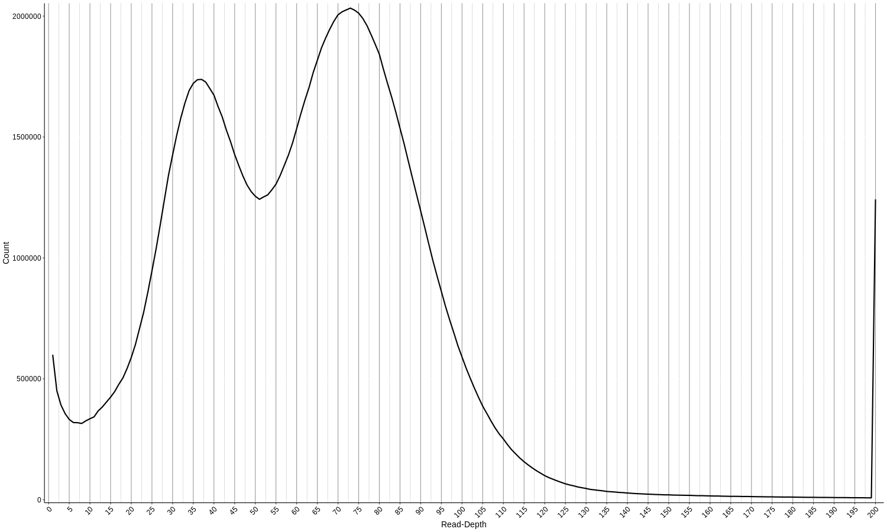

# **Dalotia Genome Assembly**

Sheila Kitchen, 2/22/2019
## Illumina Sequencing data
DNA from a culture stock of *Dalotia coriaria* (Applied Bionomics) was sequenced on the Illumina HiSeq X in 2016. The reads can be downloaded from the SRA database, [SRR4301137](https://www.ncbi.nlm.nih.gov/sra/SRR4301137).

## 1.	Read Quality Assessment
#### [FastQC v 0.11.8](https://www.bioinformatics.babraham.ac.uk/projects/fastqc/)
FastQC is used to check the quality of the raw sequencing data prior to read filtering.
```
fastqc -o ./fastqc_report -f fastq -t 4 1.fastq 2.fastq
```
-o = output directory  
-f = fastq reads (can be fastq, bam or sam)  
-t = threads

#### [cutadapt v1.18](https://cutadapt.readthedocs.io/en/stable/guide.html#basic-usage)
Now trim the Illumina adapters, remove bases that have a quality score below 15 from the 3' end, and those resulting reads that are now shorter than 50 bp.
```
cutadapt -a AGATCGGAAGAGC -A AGATCGGAAGAGC -m 50 -q 15 -j 0 \
-o 1_filtered_R1.fastq -p 1_filtered_R2.fastq \
/central/groups/Parker_lab/raw_genome_data/1_Dalotia/*_1.fastq \
/central/groups/Parker_lab/raw_genome_data/1_Dalotia/*_2.fastq
```
-a, -A = adapter  
-o = output  
-p = paired output  
-m = minimum length  
-q = quality-cutoff before adapter removal  
-j 0 = automatically detect number of cores available to use

##### Results
|Total read pairs processed         |  87,210,670|
|------------------------------------|----------:|
|  Read 1 with adapter:              |3,429,633 (3.9%)|
|  Read 2 with adapter:              | 6,818,688 (7.8%)|
|Pairs that were too short:          |   223,391 (0.3%)|
|Pairs written (passing filters):    |86,987,279 (99.7%)|

----
## 2.	Genome Size Estimation
#### [kmergenie v1.7048](http://kmergenie.bx.psu.edu/)
The script will produce many files in addition to a log file. Download the kg1_report.html and review the results for the “best” K value and estimated genome size.
```
module load R/3.5.0
kmergenie --diploid -t 10 readList1.txt -o ./kmergenie/1/kg1
```
--diploid = indicates to apply the diploid model fitting  
-t = number of threads  
readList1.txt = file with the complete path to the paired fastq reads  
-o = output filename

####	[GenomeScope v1.0](http://qb.cshl.edu/genomescope/)  (visited 10/2018)
```
#generate jellyfish histogram
module load gcc/7.3.0
module load python3/3.7.0

jellyfish count -C -m 21 -s 300M -t 10  *.fastq \
-o ./jellyfish_histograms/1/21mer_1_reads.jf

jellyfish histo ./jellyfish_histograms/1/21mer_1_reads.jf \
./jellyfish_histograms/1/21mer_reads1.histo
```
-s = maximum memory  
-t = number of threads  
-m = kmer size

 Import the histo into http://qb.cshl.edu/genomescope/



#### [findGSE](https://github.com/schneebergerlab/findGSE) – R package

The same histogram generated by jellyfish is used as input for the findGSE package. The *exp_hom=* parameter is based on the expected coverage peak of homozygous kmers. This needs to be adjusted for every genome to increase the model fit to the distribution of the data. When genome coverage is low, the *exp_hom=* parameter can be removed. Sometime even in these cases, the model still fails to converge.

```
library("findGSE")
findGSE(histo="./1/21mer_reads1.histo", sizek=21, outdir="./1/het_21mer",exp_hom=70)
```


### Summary of genome size estimate for Dalotia and other rove beetle genomes (sequenced prior to 2/11/19):


Based on the three estimators, GenomeScope is generally lower than the other two and its estimates are skewed by genome coverage. In my opinion, findGSE has the best fit model because it can handle low coverage data.

----
## 3.	Ploidy Estimation- [smudgeplot](https://github.com/tbenavi1/smudgeplot)

Based on the paper by [Kraaijeveld *et al.* 2019](http://www.g3journal.org/content/early/2019/01/31/g3.119.300584.abstract) where they found discrepancy between *in silico* genome size estimate and flow cytometry which mirrored our own data, we ran the *Dalotia* Illumina reads through smudgeplot. Smudgeplot extracts heterozygous kmer pairs from the kmer dump file and uses the coverage to determine genome structure and ploidy levels.

```
#prepare jellyfish histo for smudgeplots
L=$(kmer_cov_cutoff.R ./jellyfish_histograms/1/21mer_reads1.histo L)
U=$(kmer_cov_cutoff.R ./jellyfish_histograms/1/21mer_reads1.histo U)
echo $L $U
jellyfish dump -c -L $L -U $U ./jellyfish_histograms/1/21mer_1_reads.jf \
| hetkmers.py -k 21 -t 10 -o ./jellyfish_histograms/1/1_kmer_pairs

#smudgeplot
echo "starting smudgeplot"
smudgeplot.R -i ./jellyfish_histograms/1/1_kmer_pairs_coverages_2.tsv -o 1_smudge -t "Dalotia"
```


The results are consistent with the previously reported sub-population of triploid and tetraploid cells in the *A. bilineata* sequence data (Kraaijeveld *et al.* 2019).

-------
## Assembly Overview


## 4. Short-Read Illumina Assembly
Use the adapter-trimmed and filter reads from above (cutadapt).

#### Contig Assembly- [MEGAHIT v1.1.3](https://github.com/voutcn/megahit)
MEGAHIT is metagenomic assembler of large and/or complex sequencing reads using de Bruijn graph.

```
module load python/2.7.15

#contig assembly
megahit --k-list 21,29,39,59,79,99,119 -m 0.5 -t 10 \
-o mh_run1 -1 1_filtered_R1.fastq -2 1_filtered_R2.fastq
```
--k-list = comma separated list of kmer sizes  
-m = max memory (fraction of the total memory)  
-t = threads  
-o = output directory  
-1/-2 = comma-separated list of fasta/q paired-end #1/#2 files, can be compressed gz/bz2  

To get a quick summary of the assembly statistics, use the utility script from Abyss.

```
abyss-fac -t 0 final.contigs.fa
```
-t = minimum contig/scaffold length

##### Contig Assembly Statistics
```
n       n:0     L50     min     N80     N50     N20     E-size  max 	sum     name       
100997  100997  6826    200     800     3350    21106   15301   154630  139.4e6 final.contigs.fa
```
#### Contamination Screening of the contigs -
##### [Blobtools v1.0](https://blobtools.readme.io/docs)

Blobtools is used to classify and visualize the contigs based on G/C content and read coverage.
```
#setup pointers to common files/directories
NUM=1
fastq=/central/scratchio/sak3097/beetle/1/filtered/?.fastq
assembly=/central/groups/Parker_lab/SheilaK/genome_assemblies/1_Dalotia/megahit/mh_run1/final.contigs.fa
dir=/central/scratchio/sak3097/beetle/$NUM/mbb
nt=/central/groups/Parker_lab/tools/ncbi/nt/nt
out=/central/groups/Parker_lab/SheilaK/genome_assemblies/1_Dalotia/megahit/filtered_seqs

#map reads to genome assembly
bwa index $assembly
bwa mem -t 6 $assembly $fastq | samtools view -b - > /central/scratchio/sak3097/beetle/$NUM/mbb/1_megahit.bam

#load conda environment with blobtools installed
source activate python2

#calculate read coverage per contig
blobtools map2cov -i $assembly -b /central/scratchio/sak3097/beetle/$NUM/mbb/1_megahit.bam

#blast contigs to NCBI nt
export BLASTDB=$BLASTDB:/central/groups/Parker_lab/tools/ncbi/nt/
blastn -query $assembly -db $nt -evalue 1e-25 \
-outfmt '6 qseqid sseqid sscinames staxids bitscore' \
-out $dir/1.cul10.out -culling_limit 10 -max_hsps 1 -num_threads 6

cut -f 1,4,5 $dir/1.cul10.out > $dir/1.cul10_cut.out

#create blobtools database
blobtools create -i $assembly -c 1_megahit.bam.cov -t $dir/1.cul10_cut.out -o $dir/blob_1

#create table of taxonomy
blobtools view -i $dir/blob_1* -r superkingdom -r phylum -r order --hits

#plot the results
blobtools plot -i $dir/blob_1* -x bestsum -r phylum --format png -o 1_blobplot
```
The resulting plot of the contigs based on phylum classification. The low G/C content, high coverage contigs are repetitive content.


Next, pull out the contigs that are classified as bacterial based on the blast report. This is a **conservative** approach where only those contigs that matched with high homology to the NCBI nr database are removed.
```
#create list of contigs matching bacteria
awk '$6=="Bacteria"' blob_1.blobDB.table.txt | cut -f1 > $out/bacteria.contigIDs.txt

#pull out contigs matching bacteria (n= 1,503)
blobtools seqfilter -i $assembly -l $out/bacteria.contigIDs.txt -o $out/bacteria
```
Bacterial Contig Assembly Statistics
```
n       n:0     L50     min     N80     N50     N20     E-size  max     sum     name
1503    1503    552     203     365     476     688     543     1975    717705  bacteria.final.contigs.filtered.fna
  ```

To create a filtered scaffold without the bacterial contigs:
```
#keep all scaffolds that are not bacteria (n= 99,494)
blobtools seqfilter -i $assembly -l $out/bacteria.contigIDs.txt \
-v -o $out/filtered_megahit1
```
Assembly stats of filtered_megahit1.final.contigs.filtered.fna:
```
n       n:0     L50     min     N80     N50     N20     E-size  max     sum     name  
99494   99494   6720    200     814     3390    21274   15378  154630  138.7e6 filtered_megahit1.final.contigs.filtered.fna
```
#### Scaffold the contigs with [SOAPdenovo2 v2.04](https://github.com/aquaskyline/SOAPdenovo2), complied Nov 2, 2018
```
SOAPdenovo-fusion -D -s config -p 10 -K 75 -g k75 -c filtered_megahit1.final.contigs.filtered.fna
SOAPdenovo-127mer map -s config -p 10 -g k75
SOAPdenovo-127mer scaff -p 10 -g k75
```
-K = kmer length, good place to start is half the read length or you can try the “best” k value from kmergenie

Assembly stats of k75.scafSeq:
```
n       n:0     L50     min     N80     N50     N20     E-size  max     sum     name
60977   60977   2131    200     1690    11589   50597   29796   254674  135.9e6 k75.scafSeq
```
BUSCO v2/3 Arthropoda set: Complete:    977 (91.65%), Complete + Partial:    1044 (97.94%)


#### Scaffold with the long-reads, [SSPACE-LongRead v1.1](https://www.baseclear.com/services/bioinformatics/basetools/sspace-longread/)

```
#directory mega_sspace (minion parameters from Karlsson 2015 Scientific Reports)
perl /central/groups/Parker_lab/tools/SSPACE-LongRead_v1-1/SSPACE-LongRead.pl \
-c ./K75/k75.scafSeq \
-p /central/groups/Parker_lab/raw_genome_data/1_Dalotia/minION/all_dalotia_minION.fastq \
-i 70 -a 1500 -g -5000 -t 12 -b mega_sspaceLR
```
Assembly stats of scaffolds.fasta:
```
n       n:0     L50     min     N80     N50     N20     E-size    max     sum     name
49745   49745   49      200     4288    752951  1730180 1001995   3780050 140.9e6 scaffolds.fasta
```
BUSCO v2/3 Arthropoda set: Complete:    1044 (97.94%), Complete + Partial:    1062 (99.62%)

## 4. Long-Read Nanopore Assembly
#### Read Correction with [canu v1.8 +44](https://canu.readthedocs.io/en/latest/quick-start.html)
We ran this for the full assembly but abandoned it after realizing the computational demands required to finish the assembly process.

```
/central/groups/Parker_lab/tools/canu/Linux-amd64/bin/canu \
-correct \
 -p 1_dal -d dal_2ndrd \
 genomeSize=300m \ #BASED ON FLOW CYTOMETERY- SHOULD BE 300M
 maxThreads=10 \
 minReadLength=500 \
 useGrid=1 \
 gridOptionsJobName=Dal_CANU-500 \
 gridOptions="--time=168:00:00 --ntasks=10 --mem=128g" \
 ovlMerThreshold=500 \
 -nanopore-raw /central/groups/Parker_lab/raw_genome_data/1_Dalotia/minION/all_dalotia_minION.fastq
```
##### Results
```
In sequence store './1_dal.seqStore':
--   Found 3646827 reads.
--   Found 15874052472 bases (105.82 times coverage). #adjusted for in silico genome size
```

|category        |    	 original raw reads w/ overlap  |   original raw reads w/o  overlap|
|---------------------|-----------------:|-------------:|
|   Number of Reads     |       3,620,728|         26,099|
|   Number of Bases      |  15,841,110,528|      26,874,734|
|   Coverage             |       52.804^ |        0.090|
|   Median               |         2,356 |          759|
|   Mean                  |        4,375 |         1,029|
|   N50                   |        8,092 |         1,068|
|   Minimum               |         500 |            0|
|   Maximum               |      196,659 |        31,324|

^The estimate was based on a genome size of 300 Mb which was the flow cytometry estimate. It should actually be 104x coverage for a genome size of 150Mb.

|category|evidence reads| corrected raw|corrected expected | rescued raw| rescued expected|
|---|---:|---:|---:|---:|---:|
|Number of Reads | 2,746,153  |      1,314,705  |     1,314,705|         670,464|        670,464|
|Number of Bases|        13,411,166,841 |   12,141,253,493|   12,000,000,342   |  1,059,182,084  |  1,052,325,928|
|Coverage             |       44.704  |       40.471   |     40.000   |       3.531     |    3.508
|Median     |                   2,572     |      6,525      |    6,438      |     1,435      |    1,426
|Mean    |                      4,883   |        9,234     |     9,127 |          1,579     |     1,569
|N50       |                    9,336    |      11,281    |     11,185    |       2,026      |    2,021|
|Minimum            |            500       |    3,311      |    3,310     |       502      |     501
|Maximum       |              196,659      |   166,614    |    166,527     |     42,225     |     3,310

Found 1976175 reads.  
--   Found 12598898385 bases (83.9 times coverage). #adjusted for in silico genome size

#### Long-read Contig Assembly – [WTDBG2 Version: 2.3 (20181206)](https://github.com/ruanjue/wtdbg2)
```
#genome assembly CANU corrected Dalotia Reads
/central/groups/Parker_lab/tools/wtdbg2/wtdbg2 -x corrected -g 300m \
-i /central/groups/Parker_lab/raw_genome_data/1_Dalotia/minION/1_dal.correctedReads.fasta \
-t 16 -fo WTDBG2_corReads

/central/groups/Parker_lab/tools/wtdbg2/wtpoa-cns -t 16 \
-i WTDBG2_corReads.ctg.lay.gz -fo WTDBG2_corReads.ctg.fa
```
Assembly stats of WTDBG2_corReads.ctg.fa:
```
n       n:0     L50     min     N80     N50     N20     E-size  max     sum     name
313     313     11      3594    882067  2601835 6069552 3461881 6873940 110.4e6 WTDBG2_corReads.ctg.fa
```
BUSCO v2/3 Arthropoda set: Complete: 858 (80.49%), Complete + Partial: 984 (92.31%)

### 5. Merge Genome Assemblies
#### [quickmerge v0.3](https://github.com/mahulchak/quickmerge)
I tried the merging of the genomes in both directions, with the short-read assembly as the reference 1st and then as the query 2nd.

**MEGA- reference and WTD- query**
```
/central/groups/Parker_lab/tools/quickmerge/merge_wrapper.py -pre megaSS_wtdCR_10k -hco 5.0 -c 1.5 -l 800000 \
-ml 10000 /central/groups/Parker_lab/SheilaK/wtdbg2/correctedReads_Dal/WTDBG2_corReads.ctg.fa \
/central/groups/Parker_lab/SheilaK/genome_assemblies/1_Dalotia/megahit/filtered_seqs/mega_sspaceLR/scaffolds.fasta

abyss-fac -t 0 merged_megaSS_wtdCR_10k.fasta

n       n:0     L50     min     N80     N50     N20     E-size  max     sum     name
278     278     10      3594    1695541 3488112 6253557 4077302 9213414 106e6   merged_megaSS_wtdCR_10k.fasta
```
BUSCO v2/3 Arthropoda set: Complete: 853 (80.02%), Complete + Partial: 923 (86.59%)

**WTD- reference and MEGA- query**
```
/central/groups/Parker_lab/tools/quickmerge/merge_wrapper.py -pre wtdCRR_megaSSQ_800K_10k -hco 5.0 -c 1.5 -l 800000 \
-ml 10000 /central/groups/Parker_lab/SheilaK/genome_assemblies/1_Dalotia/megahit/filtered_seqs/mega_sspaceLR/scaffolds.fasta \
/central/groups/Parker_lab/SheilaK/wtdbg2/correctedReads_Dal/WTDBG2_corReads.ctg.fa

abyss-fac -t 0 merged_wtdCRR_megaSSQ_800K_10k.fasta

n       n:0     L50     min     N80     N50     N20     E-size  max     sum     name
39913   39913   13      200     336387  2939501 8554000 4428090 12.84e6 156e6   merged_wtdCRR_megaSSQ_800K_10k.fasta
```
BUSCO v2/3 Arthropoda set: **Complete: 946 (88.74%)**, Complete + Partial: 1017 (95.40%)

I moved on with the assembly that retained the higher BUSCO gene set.

### 6. Long-Read Polishing with [Racon v1.3.3](https://github.com/isovic/racon)

The corrected reads from canu were used to polish the genome with two rounds of polishing *via* Racon.
```
#Polish the data with long reads- Round 1
/central/groups/Parker_lab/tools/minimap2/minimap2 -t 10 -x map-ont \
-a merged_wtdCRR_megaSSQ_800K_10k.fasta \
/central/groups/Parker_lab/raw_genome_data/1_Dalotia/minION/1_dal.correctedReads.fasta \
> /central/scratchio/sak3097/beetle/1/merged_wtdCRR_megaSSQ_800K_10k.LR.sam

/central/groups/Parker_lab/tools/racon/build/bin/racon_wrapper --split 90000000 \
-t 10 /central/groups/Parker_lab/raw_genome_data/1_Dalotia/minION/1_dal.correctedReads.fasta \
/central/scratchio/sak3097/beetle/1/merged_wtdCRR_megaSSQ_800K_10k.LR.sam \
merged_wtdCRR_megaSSQ_800K_10k.fasta > racon_wtdmega.fa

#assembly stats
abyss-fac -t 0 racon_wtdmega.fa

n       n:0     L50     min     N80     N50     N20     E-size  max     sum     name
1887    1887    10      82      1599210 3470006 8508992 5104028 12.8e6  134.4e6 racon_wtdmega.fa

# Round 2
/central/groups/Parker_lab/tools/minimap2/minimap2 -t 10 -x map-ont \
-a racon_wtdmega.fa \
/central/groups/Parker_lab/raw_genome_data/1_Dalotia/minION/1_dal.correctedReads.fasta \
> /central/scratchio/sak3097/beetle/1/racon_wtdmega.LR.sam

/central/groups/Parker_lab/tools/racon/build/bin/racon_wrapper --split 90000000 \
-t 10 /central/groups/Parker_lab/raw_genome_data/1_Dalotia/minION/1_dal.correctedReads.fasta \
/central/scratchio/sak3097/beetle/1/racon_wtdmega.LR.sam \
racon_wtdmega.fa > racon_wtdmega_r2.fa

#assembly statistics
abyss-fac -t 0 racon_wtdmega_r2.fa
n       n:0     L50     min     N80     N50     N20     E-size  max     sum     name
1365    1365    10      75      1597107 3467028 8494961 5122057 12.79e6 133.6e6 racon_wtdmega_r2.fa
```
BUSCO v2/3 Arthropoda set: Complete: 911 (85.46%), Complete + Partial: 1007 (94.47%)

### 7. Gap-filling with Long-Reads - [LR_Gapcloser v1.1](https://github.com/CAFS-bioinformatics/LR_Gapcloser)

LR_Gapcloser aligns long reads to the scaffolds with BWA mem algorithm. The overlapping sequence between scaffolds are identified in the alignments and used to fill the gaps. This process is repeated for three iterations. Based on their publication (Xu *et al.* 2018), more gaps were filled using the uncorrected raw Nanopore minION reads than corrected reads.
```
#gapfilling with uncorrected nanopore reads
/central/groups/Parker_lab/tools/LR_Gapcloser_v1.1/LR_Gapcloser.sh -i racon_wtdmega_r2.fa \
-l /central/groups/Parker_lab/raw_genome_data/1_Dalotia/minION/all_dalotia_minION.fasta \
-s n -t 10 -o gapFill_uncorDcor

#assembly statistics
abyss-fac -t 0 gapclosed.fasta
n       n:0     L50     min     N80     N50     N20     E-size  max     sum     name
1365    1365    10      75      1615322 3494638 8684892 5088187 12.84e6 136.6e6 gapclosed.fasta
```
BUSCO v2/3 Arthropoda set: Complete: 913 (85.65%), Complete + Partial: 1008 (94.56%)

### 8. Short-Read Polishing - [Pilon v1.23](https://github.com/broadinstitute/pilon)

```
#Polish short reads
/central/groups/Parker_lab/tools/minimap2/minimap2 -t 10 -ax sr \
/central/groups/Parker_lab/SheilaK/genome_assemblies/1_Dalotia/quickMerge/gapFill_uncorDcor/iteration-3/gapclosed.fasta \
/central/scratchio/sak3097/beetle/1/filtered/1_filtered_R1.fastq \
/central/scratchio/sak3097/beetle/1/filtered/1_filtered_R2.fastq | samtools view \
-b - > /central/scratchio/sak3097/beetle/1/pilon1.SR.bam

samtools sort -@ 4 -o /central/scratchio/sak3097/beetle/1/alnsorted_pilon1.bam \
/central/scratchio/sak3097/beetle/1/pilon1.SR.bam

samtools index /central/scratchio/sak3097/beetle/1/alnsorted_pilon1.bam

java -Xmx240G -jar /central/groups/Parker_lab/tools/pilon-1.23.jar \
--genome /central/groups/Parker_lab/SheilaK/genome_assemblies/1_Dalotia/quickMerge/gapFill_uncorDcor/iteration-3/gapclosed.fasta \
--frags /central/scratchio/sak3097/beetle/1/alnsorted_pilon1.bam --output Dcor_pilon1 \
--chunksize 10000000 --tracks --changes --diploid --threads 10

#round 1 assembly statistics
abyss-fac -t 0 Dcor_pilon1.fasta
n       n:0     L50     min     N80     N50     N20     E-size  max     sum     name
1365    1365    10      75      1619882 3514158 8712175 5104658 12.88e6 137.1e6 Dcor_pilon1.fasta

#Repeat above with Dcor_pilon1.fasta as the genome

#round 2 assembly stats
abyss-fac -t 0 Dcor_pilon2.fasta
n       n:0     L50     min     N80     N50     N20     E-size  max     sum     name
1365    1365    10      75      1619617 3511826 8701440 5100937 12.87e6 137e6   Dcor_pilon2.fasta
```
BUSCO v2/3 Arthropoda set: Complete: 1042 (97.75%), Complete + Partial: 1052 (98.69%)

## Remove duplicate scaffolds using [Purge Haplotigs](https://bitbucket.org/mroachawri/purge_haplotigs/src/master/)

The step was included to remove duplicate scaffolds that arose from highly heterozygous regions that remained as separate haplotypes in the primary contigs. Purge Haplotigs identifies pairs of contigs that are syntenic and determines which contigs to keep for a haploid assembly.

First the long reads were mapped to the genome, sorted and indexed.
```
module load samtools/1.8
source activate purge_haplotigs_env

#long reads to genome
/central/groups/Parker_lab/tools/minimap2/minimap2 -t 10 -a -x map-ont \
/central/groups/Parker_lab/final_genomes/Dalotia/Dcor_assembly_v1_190525.softmasked.fa \
/central/groups/Parker_lab/raw_genome_data/1_Dalotia/minION/1_dal.correctedReads.fasta \
--secondary=no | samtools view -b - > /central/scratchio/sak3097/beetle/1/dalgenome_LR.bam

samtools sort -@ 10 -o /central/scratchio/sak3097/beetle/1/sorted_LR.bam /central/scratchio/sak3097/beetle/1/dalgenome_LR.bam

samtools index -@ 10 /central/scratchio/sak3097/beetle/1/sorted_LR.bam
```

Step 1: Generate a histogram of read coverage.
```
purge_haplotigs hist -b /central/scratchio/sak3097/beetle/1/sorted_LR.bam \
-g /central/groups/Parker_lab/final_genomes/Dalotia/Dcor_assembly_v1_190525.softmasked.fa  -t 10
```
From this histogram, the cutoffs for low coverage and mid-point between the haploid and diploid peak are manually determined. In the case of the long reads, there was no obvious second peak.


Step 2: Analyze the coverage of each contig.
```
purge_haplotigs cov -i /central/groups/Parker_lab/SheilaK/genome_assemblies/1_Dalotia/purge_haplotigs/sorted_LR.bam.gencov  \
-l 15  -m 70  -h 100 -o LR_coverage_stats.csv -j 80  -s 80
```
l= low coverage cutoff
m= mid-point between the two peaks
h= high coverage cutoff

Step 3: Purge pipeline. This step uses the coverage informaion and mapping file to determine which contigs to reassign or keep.
```
purge_haplotigs purge -g /central/groups/Parker_lab/final_genomes/Dalotia/Dcor_assembly_v1_190525.softmasked.fa \
-c LR_coverage_stats.csv -t 10 -o LR -r reps.bed -d -b /central/scratchio/sak3097/beetle/1/sorted_LR.bam
```

This was repeated for the PE short-reads also:
```
/central/groups/Parker_lab/tools/minimap2/minimap2 -t 10 -ax sr \
/central/groups/Parker_lab/final_genomes/Dalotia/Dcor_assembly_v1_190525.softmasked.fa \
/central/scratchio/sak3097/beetle/1/filtered/1_filtered_R1.fastq \
/central/scratchio/sak3097/beetle/1/filtered/1_filtered_R2.fastq | samtools view -b - > /central/scratchio/sak3097/beetle/1/dalgenome_SR.bam

samtools sort -@ 4 -o /central/scratchio/sak3097/beetle/1/sorted_SR.bam /central/scratchio/sak3097/beetle/1/dalgenome_SR.bam

samtools index /central/scratchio/sak3097/beetle/1/sorted_SR.bam

purge_haplotigs hist -b /central/scratchio/sak3097/beetle/1/sorted_SR.bam \
-g /central/groups/Parker_lab/final_genomes/Dalotia/Dcor_assembly_v1_190525.softmasked.fa -t 10

purge_haplotigs cov -i /central/groups/Parker_lab/SheilaK/genome_assemblies/1_Dalotia/purge_haplotigs/sorted_SR.bam.gencov  \
-l 8  -m 51  -h 140 -o SR_coverage_stats.csv -j 80  -s 80

purge_haplotigs purge -g /central/groups/Parker_lab/final_genomes/Dalotia/Dcor_assembly_v1_190525.softmasked.fa \
-c SR_coverage_stats.csv -t 10 -o SR -r reps.bed -d -b /central/scratchio/sak3097/beetle/1/sorted_SR.bam
```
This time there was a haploid and diploid peak.



The reassignment of each run was compared. Scaffolds were retained that were assigned to KEEP in both assemblies and > 1000bp in length. This changed the total genome assembly length from 137 Mb to 120 Mb.
